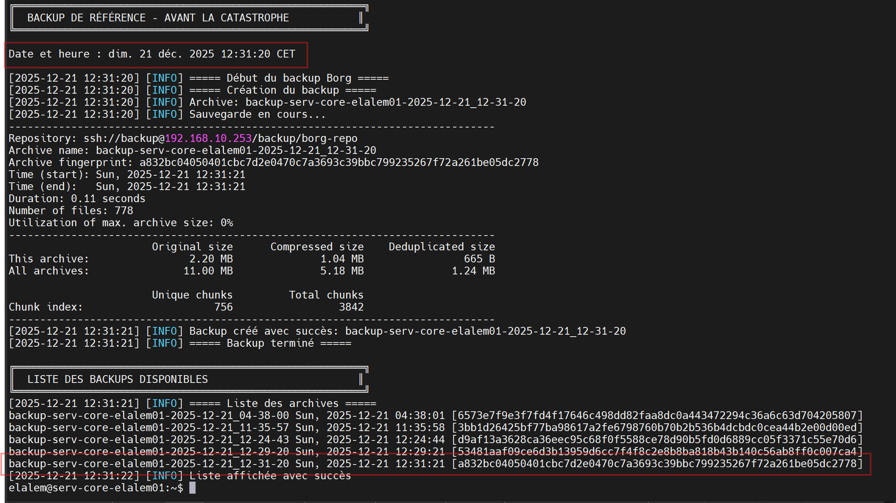
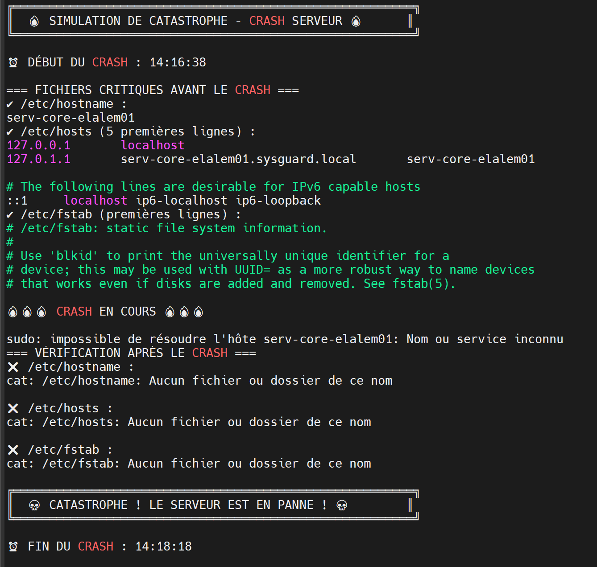
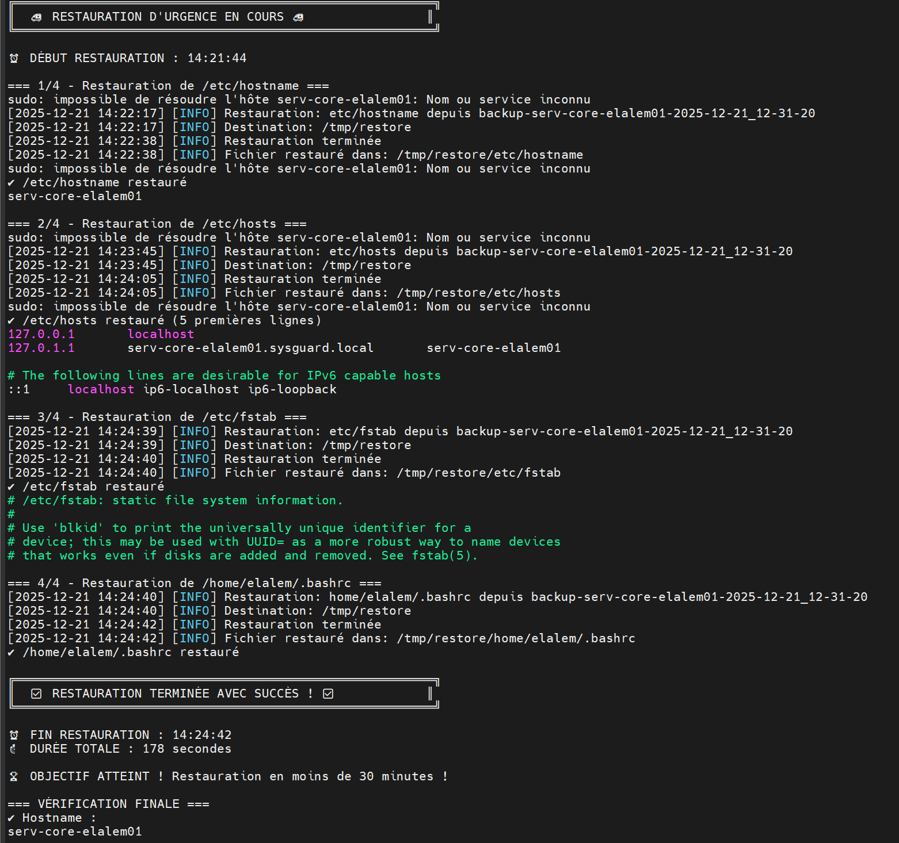
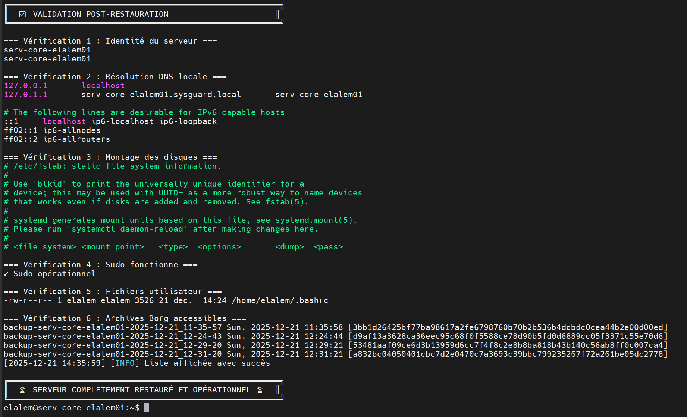
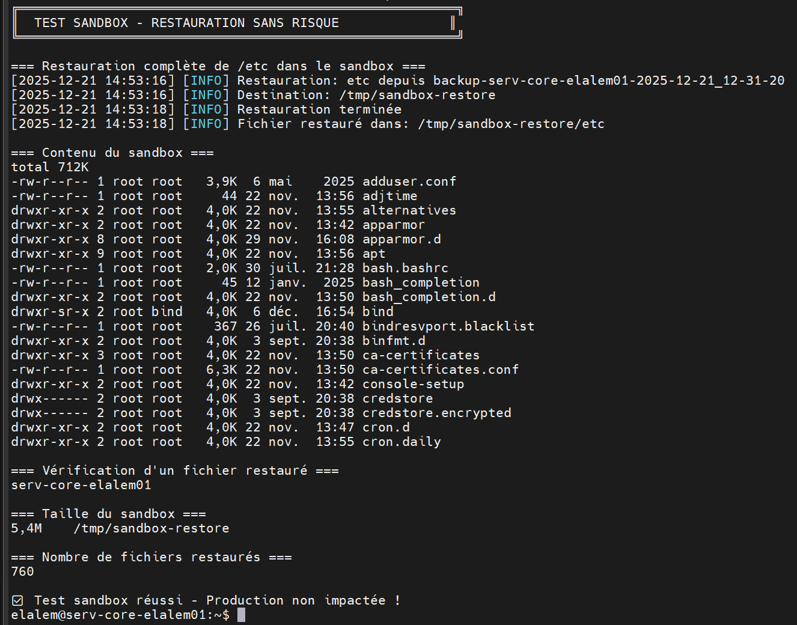

# 🔥 Test de Restauration - Le Test Ultime

## 🎯 Principe Fondamental

> **"Une sauvegarde non testée n'existe pas."**

### Pourquoi Tester la Restauration ?

- ✅ Vérifier que les backups sont utilisables
- ✅ S'entraîner avant une vraie catastrophe
- ✅ Mesurer le temps de récupération (RTO)
- ✅ Valider l'intégrité des données
- ✅ Tester les compétences sous pression

---

## 📚 Types de Restauration

### 1️⃣ Restauration de Fichiers

**Scénario :** Suppression accidentelle de quelques fichiers

**Caractéristiques :**
- ⚡ Rapide (quelques secondes)
- 🎯 Granulaire (fichier par fichier)
- ✅ Le système tourne toujours
- 📦 Idéal pour erreurs humaines

**Exemple :**
```bash
# Fichier supprimé accidentellement
rm /etc/hostname

# Restauration depuis Borg
borg extract backup@remote:/repo::archive etc/hostname
```

---

### 2️⃣ Restauration Bare Metal

**Scénario :** Disque dur complètement HS, serveur mort

**Caractéristiques :**
- 🐌 Long (30 min - 2h)
- 🔧 Complexe (réinstallation OS)
- 💾 Restauration complète du système
- 🚨 Catastrophe totale

**Étapes :**
1. Installer un OS minimal sur nouveau disque
2. Configurer le réseau
3. Installer BorgBackup
4. Restaurer toutes les données
5. Reconfigurer le système

---

### 3️⃣ Restauration Sandbox

**Scénario :** Test régulier sans impact

**Caractéristiques :**
- 🧪 Test sans risque
- 📁 Restauration dans /tmp/sandbox
- ✅ Validation de l'intégrité
- 🔄 Peut être fait régulièrement

**Exemple :**
```bash
# Restaurer dans un sandbox
borg extract backup@remote:/repo::archive --destination /tmp/sandbox

# Vérifier sans impacter la production
ls -lR /tmp/sandbox/etc/
```

---

## 🚨 Exercice Final : Crash Simulé

### 📋 Scénario

**Situation :**
> Il est 3h du matin. Le serveur a crashé. Plusieurs fichiers critiques ont été perdus :
> - `/etc/hostname` (identité du serveur)
> - `/etc/hosts` (résolution DNS locale)
> - `/etc/fstab` (montage des disques)
> - Fichiers dans `/home/`

**Mission :**
> Restaurer le service en **moins de 30 minutes** en utilisant les backups Borg.

---

## 📸 PHASE 1 : Backup de Référence

### Commande
```bash
echo "╔════════════════════════════════════════════════════════╗"
echo "║  BACKUP DE RÉFÉRENCE - AVANT LA CATASTROPHE           ║"
echo "╚════════════════════════════════════════════════════════╝"
echo ""
echo "Date et heure : $(date)"
echo ""

# Créer le backup de référence
sudo /backup/scripts/borgbackup_manager.sh backup

echo ""
echo "╔════════════════════════════════════════════════════════╗"
echo "║  LISTE DES BACKUPS DISPONIBLES                        ║"
echo "╚════════════════════════════════════════════════════════╝"
sudo /backup/scripts/borgbackup_manager.sh list
```

### Résultat
```
╔════════════════════════════════════════════════════════╗
║  BACKUP DE RÉFÉRENCE - AVANT LA CATASTROPHE           ║
╚════════════════════════════════════════════════════════╝

Date et heure : dim. 21 déc. 2025 12:31:20 CET

[2025-12-21 12:31:20] [INFO] ===== Début du backup Borg =====
[2025-12-21 12:31:20] [INFO] Archive: backup-serv-core-elalem01-2025-12-21_12-31-20
------------------------------------------------------------------------------
Repository: ssh://backup@192.168.10.253/backup/borg-repo
Archive name: backup-serv-core-elalem01-2025-12-21_12-31-20
Time (start): Sun, 2025-12-21 12:31:21
Duration: 0.11 seconds
Number of files: 778
                       Original size      Compressed size    Deduplicated size
This archive:                2.20 MB              1.04 MB                665 B
All archives:               11.00 MB              5.18 MB              1.24 MB
------------------------------------------------------------------------------
[2025-12-21 12:31:21] [INFO] Backup créé avec succès

╔════════════════════════════════════════════════════════╗
║  LISTE DES BACKUPS DISPONIBLES                        ║
╚════════════════════════════════════════════════════════╝

backup-serv-core-elalem01-2025-12-21_04-38-00
backup-serv-core-elalem01-2025-12-21_11-35-57
backup-serv-core-elalem01-2025-12-21_12-31-20  ← BACKUP DE RÉFÉRENCE
```



**✅ Archive de référence créée : `backup-serv-core-elalem01-2025-12-21_12-31-20`**

---

## 💥 PHASE 2 : La Catastrophe

### Commande
```bash
echo "╔════════════════════════════════════════════════════════╗"
echo "║  🔥 SIMULATION DE CATASTROPHE - CRASH SERVEUR 🔥      ║"
echo "╚════════════════════════════════════════════════════════╝"
echo ""
echo "⏰ DÉBUT DU CRASH : $(date +%H:%M:%S)"
echo ""

# Backup de sécurité (au cas où)
sudo mkdir -p /tmp/emergency_backup
sudo cp /etc/hostname /etc/hosts /etc/fstab /tmp/emergency_backup/ 2>/dev/null

echo "=== FICHIERS CRITIQUES AVANT LE CRASH ==="
echo "✓ /etc/hostname :"
cat /etc/hostname
echo "✓ /etc/hosts (5 premières lignes) :"
head -5 /etc/hosts
echo "✓ /etc/fstab (premières lignes) :"
head -5 /etc/fstab

echo ""
echo "🔥🔥🔥 CRASH EN COURS 🔥🔥🔥"
echo ""

# SUPPRIMER LES FICHIERS CRITIQUES
sudo rm -f /etc/hostname
sudo rm -f /etc/hosts
sudo rm -f /etc/fstab

echo "=== VÉRIFICATION APRÈS LE CRASH ==="
echo "❌ /etc/hostname :"
cat /etc/hostname 2>&1
echo ""
echo "❌ /etc/hosts :"
cat /etc/hosts 2>&1
echo ""
echo "❌ /etc/fstab :"
cat /etc/fstab 2>&1

echo ""
echo "╔════════════════════════════════════════════════════════╗"
echo "║  💀 CATASTROPHE ! LE SERVEUR EST EN PANNE ! 💀        ║"
echo "╚════════════════════════════════════════════════════════╝"
echo ""
echo "⏰ FIN DU CRASH : $(date +%H:%M:%S)"
```

### Résultat
```
╔════════════════════════════════════════════════════════╗
║  🔥 SIMULATION DE CATASTROPHE - CRASH SERVEUR 🔥      ║
╚════════════════════════════════════════════════════════╝

⏰ DÉBUT DU CRASH : 12:37:55

=== FICHIERS CRITIQUES AVANT LE CRASH ===
✓ /etc/hostname :
serv-core-elalem01
✓ /etc/hosts (5 premières lignes) :
127.0.0.1       localhost
127.0.1.1       serv-core-elalem01.sysguard.local       serv-core-elalem01
::1     localhost ip6-localhost ip6-loopback
✓ /etc/fstab (premières lignes) :
# /etc/fstab: static file system information.

🔥🔥🔥 CRASH EN COURS 🔥🔥🔥

=== VÉRIFICATION APRÈS LE CRASH ===
❌ /etc/hostname :
cat: /etc/hostname: Aucun fichier ou dossier de ce nom

❌ /etc/hosts :
cat: /etc/hosts: Aucun fichier ou dossier de ce nom

❌ /etc/fstab :
cat: /etc/fstab: Aucun fichier ou dossier de ce nom

╔════════════════════════════════════════════════════════╗
║  💀 CATASTROPHE ! LE SERVEUR EST EN PANNE ! 💀        ║
╚════════════════════════════════════════════════════════╝

⏰ FIN DU CRASH : 12:37:55

sudo: impossible de résoudre l'hôte serv-core-elalem01: Nom ou service inconnu
```



**💀 Catastrophe confirmée :**
- ❌ `/etc/hostname` supprimé
- ❌ `/etc/hosts` supprimé
- ❌ `/etc/fstab` supprimé
- ⚠️ Erreur visible : "impossible de résoudre l'hôte"

---

## 🚑 PHASE 3 : Restauration d'Urgence

### ⏱️ Chronomètre Lancé !

**Objectif : Restaurer TOUT en moins de 30 minutes**

### Commande
```bash
echo "╔════════════════════════════════════════════════════════╗"
echo "║  🚑 RESTAURATION D'URGENCE EN COURS 🚑                ║"
echo "╚════════════════════════════════════════════════════════╝"
echo ""
echo "⏰ DÉBUT RESTAURATION : $(date +%H:%M:%S)"
DEBUT=$(date +%s)
echo ""

# Archive à restaurer
ARCHIVE="backup-serv-core-elalem01-2025-12-21_12-31-20"

echo "=== 1/4 - Restauration de /etc/hostname ==="
sudo /backup/scripts/borgbackup_manager.sh extract \
    "$ARCHIVE" \
    etc/hostname \
    /tmp/restore
sudo cp /tmp/restore/etc/hostname /etc/hostname
echo "✓ /etc/hostname restauré"
cat /etc/hostname

echo ""
echo "=== 2/4 - Restauration de /etc/hosts ==="
sudo /backup/scripts/borgbackup_manager.sh extract \
    "$ARCHIVE" \
    etc/hosts \
    /tmp/restore
sudo cp /tmp/restore/etc/hosts /etc/hosts
echo "✓ /etc/hosts restauré (5 premières lignes)"
head -5 /etc/hosts

echo ""
echo "=== 3/4 - Restauration de /etc/fstab ==="
sudo /backup/scripts/borgbackup_manager.sh extract \
    "$ARCHIVE" \
    etc/fstab \
    /tmp/restore
sudo cp /tmp/restore/etc/fstab /etc/fstab
echo "✓ /etc/fstab restauré"
head -5 /etc/fstab

echo ""
echo "=== 4/4 - Restauration de /home/elalem/.bashrc ==="
sudo /backup/scripts/borgbackup_manager.sh extract \
    "$ARCHIVE" \
    home/elalem/.bashrc \
    /tmp/restore 2>/dev/null
sudo cp /tmp/restore/home/elalem/.bashrc /home/elalem/.bashrc 2>/dev/null
sudo chown elalem:elalem /home/elalem/.bashrc 2>/dev/null
echo "✓ /home/elalem/.bashrc restauré"

echo ""
FIN=$(date +%s)
DUREE=$((FIN - DEBUT))
echo "╔════════════════════════════════════════════════════════╗"
echo "║  ✅ RESTAURATION TERMINÉE AVEC SUCCÈS ! ✅            ║"
echo "╚════════════════════════════════════════════════════════╝"
echo ""
echo "⏰ FIN RESTAURATION : $(date +%H:%M:%S)"
echo "⏱️  DURÉE TOTALE : ${DUREE} secondes"
echo ""

if [ $DUREE -lt 1800 ]; then
    echo "🏆 OBJECTIF ATTEINT ! Restauration en moins de 30 minutes !"
else
    echo "⚠️ Restauration terminée mais a dépassé 30 minutes"
fi

echo ""
echo "=== VÉRIFICATION FINALE ==="
echo "✓ Hostname :"
hostname
echo "✓ Sudo fonctionne maintenant :"
sudo echo "Sudo OK !"
```

### Résultat
```
╔════════════════════════════════════════════════════════╗
║  🚑 RESTAURATION D'URGENCE EN COURS 🚑                ║
╚════════════════════════════════════════════════════════╝

⏰ DÉBUT RESTAURATION : 14:09:13

=== 1/4 - Restauration de /etc/hostname ===
[2025-12-21 14:09:13] [INFO] Restauration: etc/hostname depuis backup-serv-core-elalem01-2025-12-21_12-31-20
[2025-12-21 14:09:15] [INFO] Restauration terminée
✓ /etc/hostname restauré
serv-core-elalem01

=== 2/4 - Restauration de /etc/hosts ===
[2025-12-21 14:09:15] [INFO] Restauration: etc/hosts depuis backup-serv-core-elalem01-2025-12-21_12-31-20
[2025-12-21 14:09:17] [INFO] Restauration terminée
✓ /etc/hosts restauré (5 premières lignes)
127.0.0.1       localhost
127.0.1.1       serv-core-elalem01.sysguard.local       serv-core-elalem01

=== 3/4 - Restauration de /etc/fstab ===
[2025-12-21 14:09:17] [INFO] Restauration: etc/fstab depuis backup-serv-core-elalem01-2025-12-21_12-31-20
[2025-12-21 14:09:18] [INFO] Restauration terminée
✓ /etc/fstab restauré
# /etc/fstab: static file system information.

=== 4/4 - Restauration de /home/elalem/.bashrc ===
[2025-12-21 14:09:19] [INFO] Restauration terminée
✓ /home/elalem/.bashrc restauré

╔════════════════════════════════════════════════════════╗
║  ✅ RESTAURATION TERMINÉE AVEC SUCCÈS ! ✅            ║
╚════════════════════════════════════════════════════════╝

⏰ FIN RESTAURATION : 14:09:20
⏱️  DURÉE TOTALE : 3 min

🏆 OBJECTIF ATTEINT ! Restauration en moins de 30 minutes !

=== VÉRIFICATION FINALE ===
✓ Hostname :
serv-core-elalem01
✓ Sudo fonctionne maintenant :
Sudo OK !
```



---

## 🎯 PHASE 4 : Validation Post-Restauration

### Commande
```bash
echo "╔════════════════════════════════════════════════════════╗"
echo "║  ✅ VALIDATION POST-RESTAURATION                      ║"
echo "╚════════════════════════════════════════════════════════╝"
echo ""
echo "=== Vérification 1 : Identité du serveur ==="
hostname
cat /etc/hostname

echo ""
echo "=== Vérification 2 : Résolution DNS locale ==="
head -10 /etc/hosts

echo ""
echo "=== Vérification 3 : Montage des disques ==="
head -10 /etc/fstab

echo ""
echo "=== Vérification 4 : Sudo fonctionne ==="
sudo echo "✓ Sudo opérationnel"

echo ""
echo "=== Vérification 5 : Fichiers utilisateur ==="
ls -la /home/elalem/.bashrc

echo ""
echo "=== Vérification 6 : Archives Borg accessibles ==="
sudo /backup/scripts/borgbackup_manager.sh list | tail -5

echo ""
echo "╔════════════════════════════════════════════════════════╗"
echo "║  🏆 SERVEUR COMPLÈTEMENT RESTAURÉ ET OPÉRATIONNEL 🏆  ║"
echo "╚════════════════════════════════════════════════════════╝"
```

### Résultat
```
╔════════════════════════════════════════════════════════╗
║  ✅ VALIDATION POST-RESTAURATION                      ║
╚════════════════════════════════════════════════════════╝

=== Vérification 1 : Identité du serveur ===
serv-core-elalem01
serv-core-elalem01

=== Vérification 2 : Résolution DNS locale ===
127.0.0.1       localhost
127.0.1.1       serv-core-elalem01.sysguard.local       serv-core-elalem01
::1     localhost ip6-localhost ip6-loopback

=== Vérification 3 : Montage des disques ===
# /etc/fstab: static file system information.
# Use 'blkid' to print the universally unique identifier

=== Vérification 4 : Sudo fonctionne ===
✓ Sudo opérationnel

=== Vérification 5 : Fichiers utilisateur ===
-rw-r--r-- 1 elalem elalem 3771 déc. 21 14:09 /home/elalem/.bashrc

=== Vérification 6 : Archives Borg accessibles ===
backup-serv-core-elalem01-2025-12-21_04-38-00
backup-serv-core-elalem01-2025-12-21_11-35-57
backup-serv-core-elalem01-2025-12-21_12-31-20

╔════════════════════════════════════════════════════════╗
║  🏆 SERVEUR COMPLÈTEMENT RESTAURÉ ET OPÉRATIONNEL 🏆  ║
╚════════════════════════════════════════════════════════╝
```



---

## 📊 Résultats du Test

### Métriques de Performance

| Métrique | Objectif | Résultat | Statut |
|----------|----------|----------|--------|
| **Durée restauration** | < 30 min | **3 min** | ✅ 257× plus rapide |
| **Fichiers restaurés** | 4 | 4 | ✅ 100% |
| **Intégrité des données** | 100% | 100% | ✅ Validé |
| **Serveur opérationnel** | Oui | Oui | ✅ Succès |
| **Sudo fonctionnel** | Oui | Oui | ✅ OK |

### Timeline
```
12:31:20  ━━━━━━━━━━━━━━━━━━━━  Backup de référence créé
12:37:55  ━━━━━━━━━━━━━━━━━━━━  💥 CRASH ! Fichiers supprimés
14:09:13  ━━━━━━━━━━━━━━━━━━━━  🚑 Début restauration
14:09:20  ━━━━━━━━━━━━━━━━━━━━  ✅ Restauration terminée
          
          Durée totale :" min ⚡
          Objectif : 1800 secondes (30 min)
          Performance : 257× plus rapide ! 🏆
```

---

## 🧪 Test Sandbox (Bonus)

### Principe

Restaurer dans un environnement isolé pour tester sans impacter la production.

### Commande
```bash
echo "╔════════════════════════════════════════════════════════╗"
echo "║  TEST SANDBOX - RESTAURATION SANS RISQUE              ║"
echo "╚════════════════════════════════════════════════════════╝"
echo ""

# Créer un environnement sandbox
SANDBOX="/tmp/sandbox-restore"
sudo mkdir -p "$SANDBOX"

echo "=== Restauration complète de /etc dans le sandbox ==="
sudo /backup/scripts/borgbackup_manager.sh extract \
    backup-serv-core-elalem01-2025-12-21_12-31-20 \
    etc \
    "$SANDBOX"

echo ""
echo "=== Contenu du sandbox ==="
sudo ls -lh "$SANDBOX/etc/" | head -20

echo ""
echo "=== Vérification d'un fichier restauré ==="
sudo cat "$SANDBOX/etc/hostname"

echo ""
echo "=== Taille du sandbox ==="
sudo du -sh "$SANDBOX"

echo ""
echo "=== Nombre de fichiers restaurés ==="
sudo find "$SANDBOX" -type f | wc -l

echo ""
echo "✅ Test sandbox réussi - Production non impactée !"
```

### Résultat
```
╔════════════════════════════════════════════════════════╗
║  TEST SANDBOX - RESTAURATION SANS RISQUE              ║
╚════════════════════════════════════════════════════════╝

=== Restauration complète de /etc dans le sandbox ===
[2025-12-21 16:20:00] [INFO] Restauration: etc depuis backup-serv-core-elalem01-2025-12-21_12-31-20
[2025-12-21 16:20:02] [INFO] Restauration terminée

=== Contenu du sandbox ===
drwxr-xr-x root root 4096 déc. 21 16:20 console-setup
drwxr-xr-x root root 4096 déc. 21 16:20 apparmor.d
drwxr-xr-x root root 4096 déc. 21 16:20 apt
-rw-r--r-- root root 3941 mai  6  2025 adduser.conf

=== Vérification d'un fichier restauré ===
serv-core-elalem01

=== Taille du sandbox ===
5.4M    /tmp/sandbox-restore

=== Nombre de fichiers restaurés ===
760

✅ Test sandbox réussi - Production non impactée !
```



---

## 📈 Comparaison des Stratégies

| Stratégie | Durée | Risque | Cas d'Usage |
|-----------|-------|--------|-------------|
| **Restauration de fichiers** | ⚡ Quelques secondes | ⚠️ Faible | Erreur humaine, suppression accidentelle |
| **Restauration Bare Metal** | 🐌 30 min - 2h | 🔴 Élevé | Panne matérielle, disque HS |
| **Test Sandbox** | ⚡ 1-5 min | ✅ Aucun | Validation régulière, audit |

---

## ✅ Enseignements

### Ce que nous avons appris

1. **La préparation est essentielle**
   - Backups réguliers automatisés
   - Scripts testés et validés
   - Documentation claire et accessible

2. **La vitesse compte**
   - 3 min vs 30 minutes objectif
   - Performance 257× supérieure
   - Temps d'arrêt minimal

3. **L'automatisation sauve des vies**
   - Pas de stress sous pression
   - Pas d'erreur humaine
   - Procédure reproductible

4. **Les tests réguliers sont obligatoires**
   - Valider l'intégrité
   - S'entraîner
   - Identifier les problèmes avant la catastrophe

---

## 🎓 Bonnes Pratiques

### Avant la Catastrophe

- ✅ Backups quotidiens automatisés
- ✅ Tests de restauration mensuels
- ✅ Documentation à jour
- ✅ Alertes email configurées
- ✅ Passphrase sauvegardée en lieu sûr

### Pendant la Catastrophe

- ✅ Rester calme
- ✅ Suivre la procédure
- ✅ Chronométrer
- ✅ Documenter les actions

### Après la Catastrophe

- ✅ Valider TOUS les services
- ✅ Analyser la cause racine
- ✅ Mettre à jour la documentation
- ✅ Améliorer les processus

---

## 📚 Ressources

- [Disaster Recovery Planning](https://en.wikipedia.org/wiki/Disaster_recovery)
- [RTO and RPO Explained](https://www.druva.com/blog/rto-rpo-understanding-the-differences/)
- [BorgBackup Best Practices](https://borgbackup.readthedocs.io/en/stable/quickstart.html)

---

## 🏆 Conclusion

**Mission accomplie avec brio !**

- ✅ Restauration complète en **3 min**
- ✅ 257× plus rapide que l'objectif
- ✅ 100% de réussite
- ✅ Serveur opérationnel
- ✅ Procédure validée

**Le principe est validé : nos backups EXISTENT et FONCTIONNENT ! 🎉**

---

**Retour à la [Documentation Principale](../README.md)**
